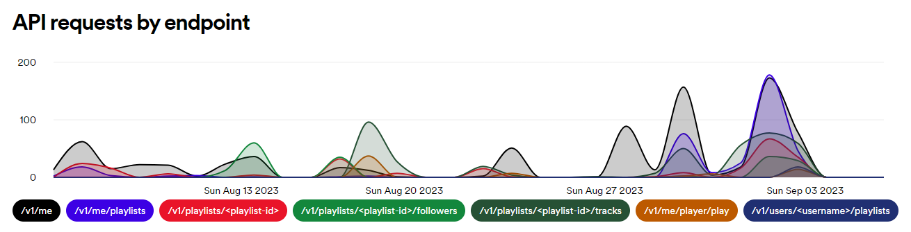

## Monthly overview of API Calls



## Files
#### static/music
- **create.js**. JavaScript file that uses a Fetch API from a form to the backend server. After the data is received it stores it locally and and sends a post method to the Spotify API in order to make the playlist.
- **explore.js**. First it loads all the available tags to the search bar so the user find it faster when the user is typing. All the tags that the user types are stored inside an array and then shows those playlists that have those tags.
- **playlist.js**. First it hides the edit elements if the user is the creator of the playlist. Then, changes to the image according to both colors are positioned under the image div. Also a method to change the hex color once an event happens (a new color is changed) is added. 
	- addTags() This function deserves it's own section because it's the root for the many to many relationships after the user presses the enter key for the form. Managing a key and working with javascript method inside a tags was a way to make it more intuitive. However, the backend part also uploads, with related name properties, the tags and group the playlists with similar properties.
- **index.js**. Simply changes each card color with the data attribute on the HTML tag.
- **profile.js**. This file contains the core of the communication between the App and the Spotify API using a couple of methods for the workflow. First, and the most important part, the user can be authenticated or not, if not then the user is redirected to the spotify grant access page. With that URI the user is sent back to the profile.html site and now an instance of the SpotifyToken, given by the Spotify API, is saved. This token expires an hour after its created, and for that reason another token is stored (access_token). With the access token the user will get the data but the refresh token (another token to store) will be used each time the user must retrieve data, or put simply, once it reloads the page. Not only this process is made for this file, each page that the user visit a authorization is done to avoid corrupted data or out of date data.
	- With the method storePlaylist() the user is able to save and follow the playlists that would like to make public for this website. Since a Spotify playlist can be followed even if it's set to private, there's no need to make a private-only filter for my application.
	 - loadPlaylists(offset). This function also is represented in another block because according to the offset configuration the more playlists will be displayed. Using the window class it was possible to consider going the the bottom of the page as an event and hence load more playlists, like some websites.
- **recommended.js** Changes the background of the cards.
- **styles.css**. Styling for each document.
#### templates/music
- **create.html**. Create playlist form.
- **Explore.html**. Here the user will be able to filter tags and playlists with pre-loaded data making the quering faster.
- **index.html**. Main page where each card is displayed according to date uploaded.
- **layout.html**. Maing format used to display a navbar and styling, preloads the bootsrap library.
- **login.html**. Page to login if the user doesn't have an account. Redirection page for sites where the user doesn't have an access.
- **playlist.html**. Format for each playlist, displaying the color and songs. For each song a get method is called to the spotify API since it would take a higher space to store each song on the server.
- **profile.html**. Template to authorize spotify callback and view stored playlists.
- **recommended.html**. Displays cards according to the user's likings and most listened genres.
- **register.html**. Make an account for the App.
#### music/
- **util.py**. Another file to separate the authentication methods from the views.py file. It is imported inside views.py and it has methods for creating a new instance of the User entity along with SpotifyToken so no repeated tokens are stored. An easier method to get the spotify token was created for updating automally in case the refresh token has expired.
- **urls.py**. All urls the the user have access to and those designed for the Fetch API calls.
- **models.py**. Models of SpotifyToken, User, Token, Playlist, Song and UserFollowing
- **credentials.py**. Stores the App's credentials to acces information to Spotify API. Working as a Bearer, these credentials are unique.
- **apps.py**. Our App (Music) is added to the server.
- **admin.py**. Each instance is loaded and updated for the admin to change data.
- **views.py**. Contains all the routes and functions used for the requests. For the templates some of the functions handle request and user authorization while others communicate directly to Spotify API using Requests.
## How to run
In order to run the server, the lastest version of pip is needed for installing the Request library with the next command:
```
python -m pip install requests
```
Also the app uses rest_framework to give specific responses back to the front-end with fetch calls, it can be installed with:
```
pip install djangorestframework
```

## Additional information
For security purposes, both the client SECRET and CLIENT_ID on the credentials.py have been rotated, following Spotify's recommendation. For the website to work, both CLIENT_ID and CLIENT_SECRET must be changed for the host's application after one is created in the next link: https://developer.spotify.com/dashboard
